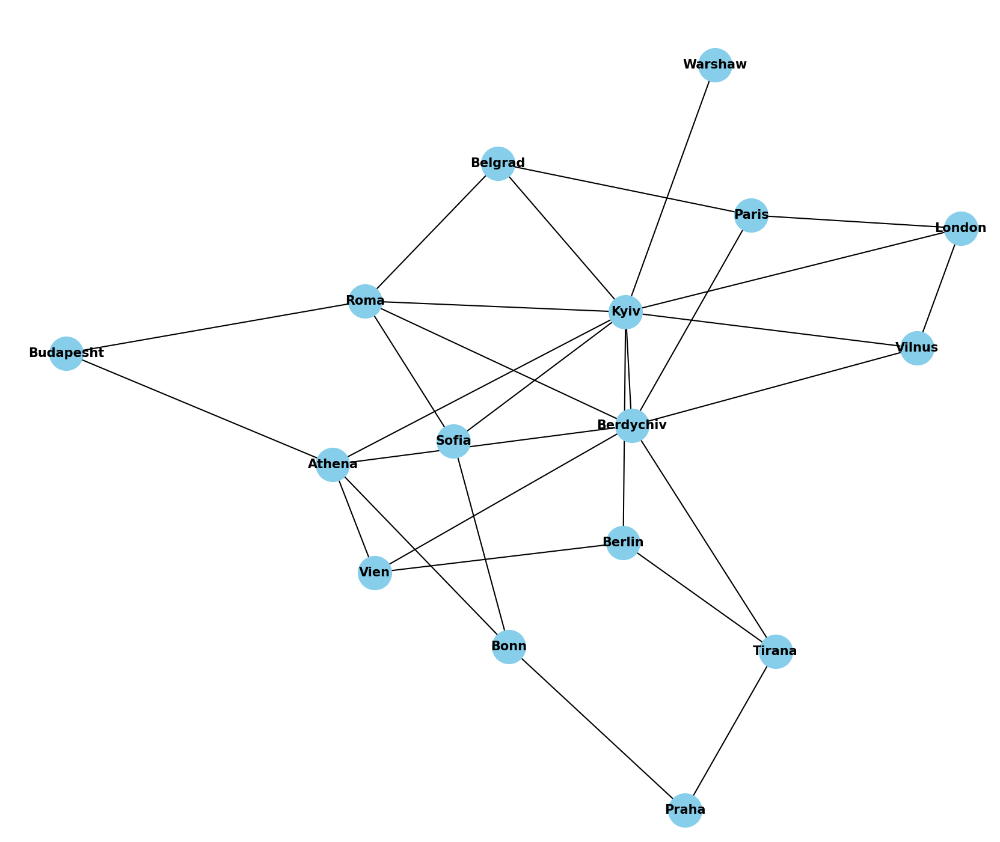

1)  to setup virtual environment:
python -m venv .venv
2) to activate virtual environment on Mac, Linux
source .venv/bin/activate
3)  to install required packages
pip3 install -r requirements.txt
results:

Vertexes: 16
Edges: 29
Each edge pow:
Kyiv: 9
Warshaw: 1
Budapesht: 2
Sofia: 3
Athena: 5
Belgrad: 3
Praha: 2
Berdychiv: 7
Berlin: 3
Vien: 3
Vilnus: 3
Tirana: 3
London: 3
Roma: 5
Paris: 3
Bonn: 3

